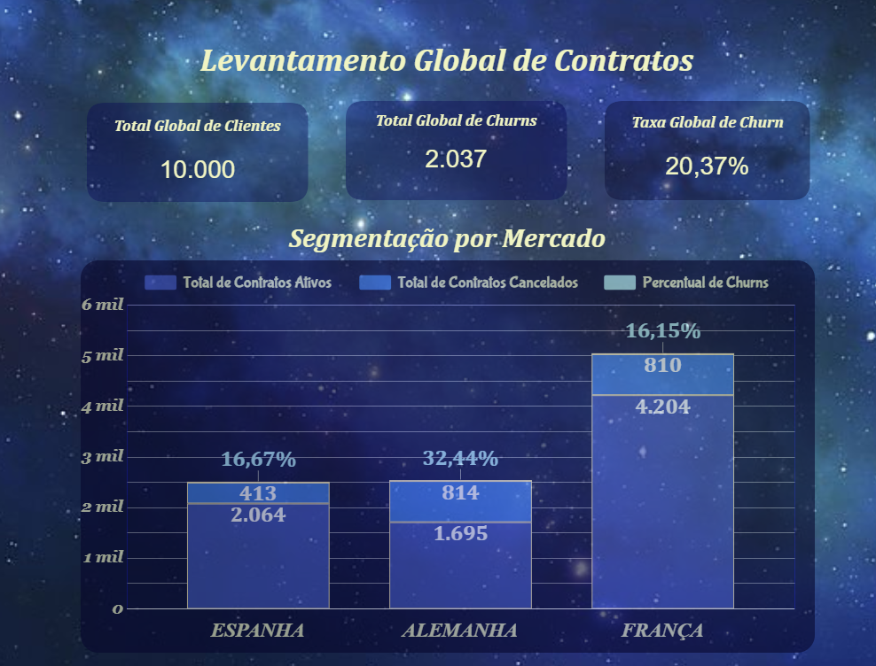
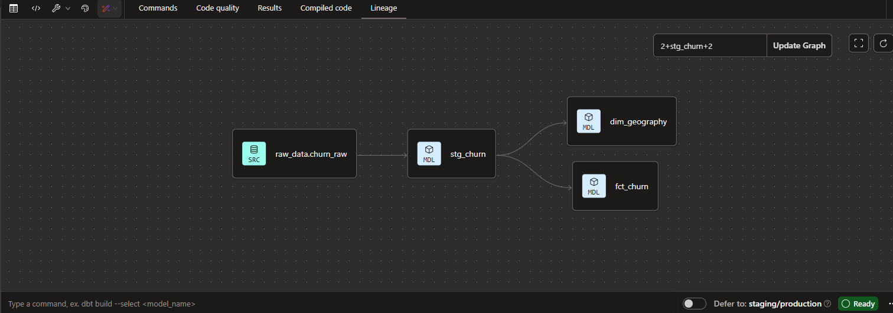

# Projeto Pipeline_de_Dados
Repositório destinado à apresentação e publicação do projeto de Engenharia de Dados

# 🚀 Projeto de Engenharia de Dados: Análise de Churn

### 🛠️ O Contexto
Este projeto demonstra a construção de um pipeline de dados moderno (Modern Data Stack), transformando dados brutos em insights estratégicos. Com mais de 30 anos de experiência em sistemas Unix e Bancos de Dados, apliquei conceitos sólidos de modelagem em ferramentas cloud de última geração.

### 🏗️ Arquitetura do Projeto
* **Armazenamento:** Google BigQuery (Data Warehouse).
* **Transformação:** dbt (Data Build Tool) para modelagem e limpeza.
* **Orquestração:** Apache Airflow (DAGs de automação).
* **Visualização:** Looker Studio (Dashboard Executivo).

### 📊 Resultados Visuais

*Visualização do "Céu Noturno" com métricas de retenção por país e KPIs globais.*

### ⛓️ Linhagem de Dados (dbt)

*Estrutura de Staging, Dimensões e Fatos seguindo as melhores práticas de Engenharia.*

### ⚙️ Diferenciais Técnicos
- **Conversão de Tipos:** Tratamento de dados geográficos e conversão de strings para métricas precisas.
- **Qualidade:** Implementação de testes de integridade via dbt.
- **Automação:** Planejamento de DAGs no Airflow para execução diária.
  
